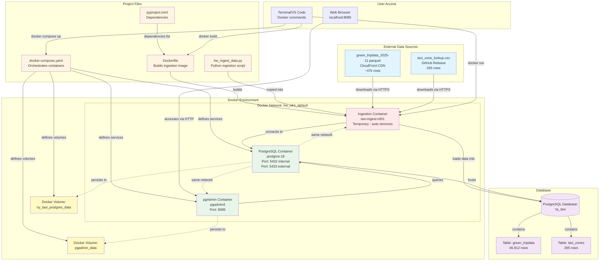
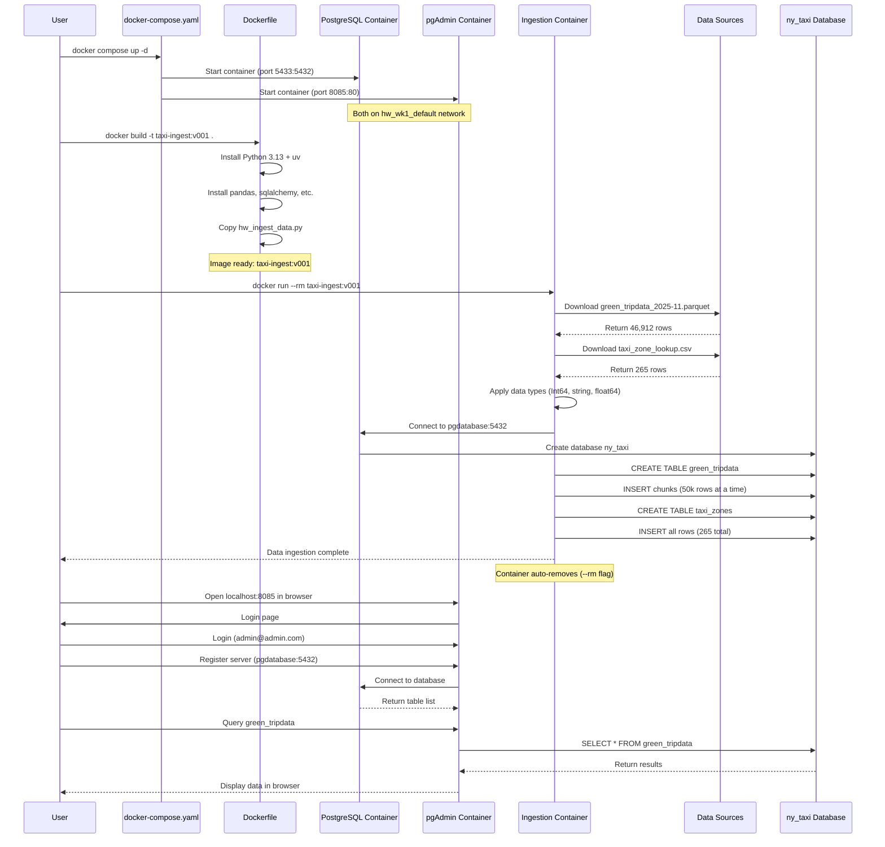
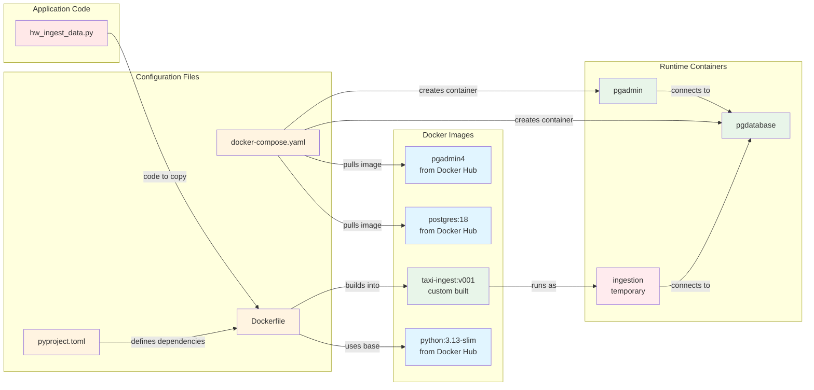
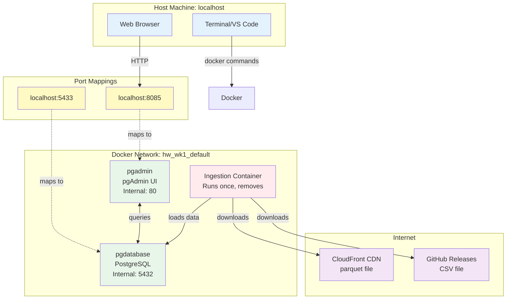
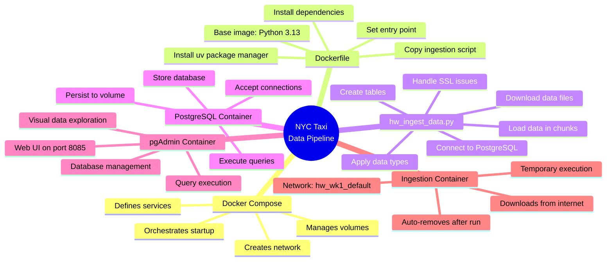

# NYC Taxi Data Ingestion - System Architecture 

**From Claude. NOT reviewed for accuracy yet.**

## System Overview Diagram

## Data Flow Sequence

## File Relationships

## Network Architecture

## Component Responsibilities

## Legend

**Colors:**
- 🔵 Blue: External data sources or images
- 🟡 Yellow: Configuration files
- 🟢 Green: Running containers
- 🔴 Red: Temporary/ephemeral components
- 🟣 Purple: Database objects
- ⚪ Gray: Storage/volumes

**Line Types:**
- Solid arrows (→): Active connections or actions
- Dotted arrows (-.->): Persistent storage or network relationships
